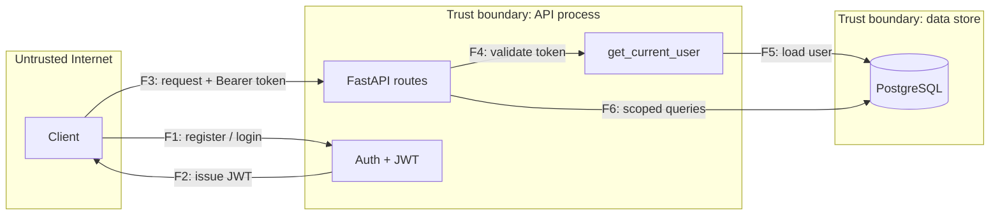

# Threat Model: enterprise-ecommerce-api

A STRIDE threat model of the API. Every mitigated threat points at the regression
test that enforces it, so this document stays honest as the code changes: a claim
with no test says so.

- **Modeled at commit:** `b20c642` (pre-remediation), with mitigations tracked
  through the `security/hardening` branch.
- **Companion:** [`SECURITY-AUDIT.md`](../SECURITY-AUDIT.md) for the fixes.

## 1. Scope

**In scope:** the FastAPI application, its PostgreSQL store, the container image
and compose definition, and the CI pipeline.

**Out of scope:** the hosting platform, TLS termination, a real payment processor
(none is integrated), and any browser client.

## 2. Assets

| Asset | Why it matters | Impact if lost |
|---|---|---|
| Customer PII (email, name) | Regulated personal data | High |
| Password hashes (bcrypt) | Credential theft, reuse | High |
| JWT signing key | Forge any user's session | Critical |
| Order and pricing data | Business confidentiality, integrity | Medium |
| Admin privilege | Full read across tenants | Critical |

## 3. Actors and trust levels

| Actor | Trusted to |
|---|---|
| Anonymous | Register, log in. Nothing else. |
| Authenticated customer | Read and write only their own orders |
| Admin | Read across all customers |
| CI runner | Read the repo, run scanners; no production secrets |

## 4. Data flow (Level 1)

Trust boundaries and the assumption each rests on:

- **TB1 Internet ↔ API.** All request data is hostile. Every field must be
  validated; privilege must never be taken from the body.
- **TB2 API ↔ PostgreSQL.** The DB trusts the app to scope queries by tenant.
- **TB3 API ↔ secrets.** The signing key is supplied by the environment and is
  never a code default.
- **TB4 CI ↔ dependencies.** Third-party packages and actions are pinned; a
  scanner gate blocks known-vulnerable ones.

## 5. STRIDE

| # | Element / flow | STRIDE | Threat | Control | Verified by |
|---|---|---|---|---|---|
| 1 | F1 register | **E**levation | Caller sets `is_admin` in the body | Field forbidden (422); server forces non-admin | `test_register_rejects_is_admin_field` |
| 2 | F6 order summary | **I**nfo disclosure | Non-admin reads other tenants' email/orders | Query scoped by `user_id` in route and SQL predicate | `test_order_summary_scopes_to_owner` |
| 3 | F2 JWT issuance | **S**poofing | App boots with a known signing key | No default key; fail-fast validator | `test_settings_requires_secret_key` |
| 4 | F4 token validation | **S**poofing | Token minted for another audience accepted | Verify `aud` and `iss`, not just signature | `test_token_with_wrong_audience_is_rejected` |
| 5 | F4 token validation | **T**ampering | Token re-signed with a different key | Signature verified against the secret | `test_token_signed_with_wrong_key_is_rejected` |
| 6 | F4 token validation | **D**enial of service | Malformed `sub` crashes the handler (500) | Parse at boundary, 401 on failure | `test_malformed_subject_returns_401_not_500` |
| 7 | F1 login | **S**poofing | Online password guessing | Per-(ip,user) lockout after 5 failures | `test_login_locks_out_after_repeated_failures` |
| 8 | F1 register | **I**nfo disclosure | Enumerate which accounts exist | Generic 409 message | `test_duplicate_registration_does_not_confirm_account` |
| 9 | F3 CORS | **S**poofing | Credentialed cross-origin call from any site | Explicit origin allowlist | `test_cors_rejects_unlisted_origin` |
| 10 | Container | **T**ampering | Dev `--reload`, root bind mount, unpinned base | Hardened image, no bind mount | `trivy config` in CI (manual review) |
| 11 | F1 login | **R**epudiation | No audit trail of auth events | **Unmitigated.** No structured auth logging yet | none |
| 12 | Dependencies | **T**ampering | Known-vulnerable package or action | Pinned versions + scanner gate | `.github/workflows/security.yml` |

## 6. Top risks (CVSS v3.1)

| ID | Vector | Base | Note |
|---|---|---|---|
| ECOM-01 | `AV:N/AC:L/PR:N/UI:N/S:U/C:H/I:H/A:N` | 9.1 | Network, no auth, high confidentiality + integrity loss |
| ECOM-02 | `AV:N/AC:H/PR:N/UI:N/S:U/C:H/I:H/A:N` | 7.4 | High attack complexity: needs the deploy to lack a key |
| ECOM-03 | `AV:N/AC:H/PR:N/UI:N/S:U/C:H/I:N/A:N` | 5.9 | Requires a token from a sibling service on the same key |

## 7. Residual and accepted risks

- **Auth event logging (#11)** is unmitigated. Next step: structured logs for
  login success/failure and admin actions.
- **ecdsa PYSEC-2026-1325** is accepted in `security/baseline.json`: unreachable
  under HS256, no upstream fix, expires 2026-11-01.
- **Rate limiting** is single-instance only; see `SECURITY-AUDIT.md`.

## 8. Assurance summary

12 STRIDE cells: **10 mitigated and test-enforced**, 1 verified by scanner/manual
review (#10), 1 unmitigated (#11). Re-derive by counting the `Verified by` column.
